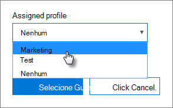

# Criar e editar perfis AutoPilotCreate and edit AutoPilot profiles

## Criar um perfilCreate a profile

Um perfil aplica-se a um dispositivo ou grupo de dispositivos.A profile applies to a device, or a group of devices,
  
1. No centro de Administração de Negócios Microsoft 365, escolha **Dispositivos** \> **AutoPilot**.In the Microsoft 365 Business Admin center, choose **Devices** \> **AutoPilot**.
  
2. Na página **AutoPilot,** \*\*\*\* escolha o \> separador Perfis **Criar perfil**.On the **AutoPilot** page, choose the **Profiles** tab \> **Create profile**.
    
3. Na página de **perfil Criar,** introduza um nome para o perfil que o ajude a identificá-lo, por exemplo, marketing.On the **Create profile** page, enter a name for the profile that helps you identify it, for example Marketing. Ligue a definição que deseja e, em seguida, escolha **Guardar**.Turn on the setting you want, and then choose **Save**. Para obter mais informações sobre as definições de perfil autoPilot, consulte as definições de [perfil autopilot](autopilot-profile-settings.md).For more information about AutoPilot profile settings, see [About AutoPilot Profile settings](autopilot-profile-settings.md).
    
    
  
### Aplicar o perfil a um dispositivoApply profile to a device

Depois de criar um perfil, pode aplicá-lo a um dispositivo ou a um grupo de dispositivos.After you create a profile, you can apply it to a device or a group of devices. Pode escolher um perfil existente no [guia passo a passo](add-autopilot-devices-and-profile.md) e aplicá-lo a novos dispositivos ou substituir um perfil existente para um dispositivo ou grupo de dispositivos.You can pick an existing profile in the [step-by-step guide](add-autopilot-devices-and-profile.md) and apply it to new devices, or replace an existing profile for a device or group of devices. 
  
1. Na página **Preparar Windows**, selecione o separador **Dispositivos**.On the **Prepare Windows** page, choose the **Devices** tab. 
    
2. Selecione a caixa de verificação ao lado de um nome de dispositivo e, no painel **dispositivo,** escolha um perfil da lista \> de abandono do **perfil atribuído** **Save**.Select the check box next to a device name, and in the **Device** panel, choose a profile from the **Assigned profile** drop-down list \> **Save**.
    
    
  
## Editar, eliminar ou remover um perfilEdit, delete, or remove a profile

Depois de atribuir um perfil a um dispositivo, pode atualizá-lo, mesmo se já tiver atribuído o dispositivo a um utilizador. Quando o dispositivo for ligado à Internet, irá transferir a versão mais recente do seu perfil durante o processo de configuração. Se o utilizador restaurar o respetivo dispositivo para as predefinições de fábrica, o dispositivo irá transferir novamente as atualizações mais recentes para o seu perfil.Once you've assigned a profile to a device, you can update it, even if you've already given the device to a user. When the device connects to the internet, it downloads the latest version of your profile during the setup process. If the user restores their device to its factory default settings, the device will again download the latest updates to your profile. 
  
### Editar um perfilEdit a profile

1. Na página **Preparar Windows**, selecione o separador **Perfis**.On the **Prepare Windows** page, choose the **Profiles** tab. 
    
2. Selecione a caixa de verificação ao lado de um nome \> de dispositivo e, no painel **Profile,** atualize qualquer uma das definições disponíveis **Guardar**.Select the check box next to a device name, and in the **Profile** panel, update any of the available settings \> **Save**.
    
    Se o fizer antes de um utilizador ligar o dispositivo à Internet, o perfil será aplicado no processo de configuração.If you do this before a user connects the device to the internet, then the profile gets applied to the setup process.
    
### Eliminar um perfilDelete a profile

1. Na página **Preparar Windows**, selecione o separador **Perfis**.On the **Prepare Windows** page, choose the **Profiles** tab. 
    
2. Selecione a caixa de verificação ao lado de um nome de dispositivo e, no painel **profile,** selecione Eliminar o **perfil** \> **Save**.Select the check box next to a device name, and in the **Profile** panel, select **Delete profile** \> **Save**.
    
    Quando eliminar um perfil, o mesmo será removido do dispositivo ou grupo de dispositivos ao qual estava atribuído.When you delete a profile, it gets removed from a device or a group of devices it was assigned to.
    
### Remover um perfilRemove a profile

1. Na página **Preparar Windows**, selecione o separador **Dispositivos**.On the **Prepare Windows** page, choose the **Devices** tab. 
    
2. Selecione a caixa de verificação ao lado de um nome de dispositivo \> e, no painel **dispositivo,** escolha **nenhuma** da lista de abandono do **perfil atribuído** **Save**.Select the check box next to a device name, and in the **Device** panel, choose **None** from the **Assigned profile** drop-down list \> **Save**.
    
