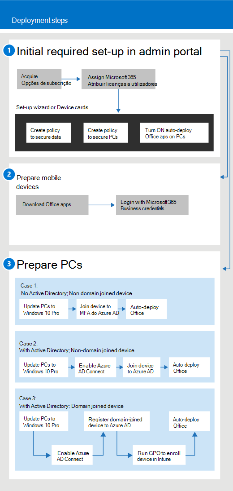

# Introdução ao Microsoft 365 Business

## O que é o Microsoft 365 Business

O Microsoft 365 Business é um conjunto abrangente de ferramentas de produtividade e colaboração de negócios, como outlook, Word, Excel e outros produtos do Office, que estão sempre atualizados. Pode proteger os seus ficheiros de trabalho em todos os dispositivos iOS, Android e Windows 10 com segurança de qualidade empresarial que é simples de gerir.

Veja este vídeo para uma visão geral rápida do Microsoft 365 Business.  

> [!VIDEO https://www.microsoft.com/videoplayer/embed/RE2mhaA] 
  
O Microsoft 365 Business destina-se a até 300 licenças. Se precisar de mais licenças, consulte a documentação da [Microsoft 365 Enterprise](https://go.microsoft.com/fwlink/p/?linkid=860986) para obter mais informações. 
  
## Obter o Microsoft 365 Empresas

- Se tiver um parceiro, obterão o Microsoft 365 Business: Obtenha o [Microsoft 365 Business do Microsoft Partner Center](get-microsoft-365-business.md).
    
- Se não tiver um parceiro e quiser obter o Microsoft 365 Business, pode [comprá-lo aqui](https://www.microsoft.com/microsoft-365/business).
    
## Configurar o Microsoft 365 Empresas

 **Visão geral da Microsoft 365 Business Suite configurada**
  
O diagrama seguinte descreve como os administradores configuram o Microsoft 365 Business. Também descreve os passos para preparar os PCs com Windows para o Microsoft 365 Business. Também pode adicionar novos dispositivos no centro de administração do Microsoft 365 Business com [o Windows AutoPilot](add-autopilot-devices-and-profile.md). Pode utilizar o AutoPilot para configurar e configurar novos dispositivos para que estejam prontos para uso produtivo assim que um utilizador entrar com as suas credenciais de NegócioS Microsoft 365.
  

Veja este vídeo para uma visão geral da configuração do Microsoft 365 Business.  

> [!VIDEO https://www.microsoft.com/videoplayer/embed/RE1FYSM] 

Caso tenha considerado este vídeo útil, consulte a [série de formação completa para pequenas empresas e as novidades do Microsoft 365](https://support.office.com/article/6ab4bbcd-79cf-4000-a0bd-d42ce4d12816).

  
### 1: Configurar o Microsoft 365 Business (Administrador)

Inscreva-se no [Microsoft 365 Business admin center](https://portal.office.com/adminportal/home) com as suas credenciais de administração global e complete os seguintes passos para configurar o Microsoft 365 Business. 
  
1. [Pré-requisitos para proteger dados em dispositivos com o Microsoft 365 Business](pre-requisites-for-data-protection.md)
    
    Leia os pré-requisitos primeiro para se certificar de que os seus dispositivos estão prontos para o Microsoft 365 Business.
    
2. [Utilize o assistente de configuração para configurar o Microsoft 365 Business](set-up.md)
    
    Se estiver **a mover-se permanentemente de um Diretório Ativo local para a nuvem,** pode ir ao centro de administração do Microsoft 365 Business e utilizar o assistente de configuração para adicionar os seus utilizadores manualmente, ou pode fazer uma sincronização única com o Azure AD Connect. Existem duas formas de o fazer: 
    
    - Se também tiver um servidor Exchange 2010, Exchange 2013 ou Exchange 2016, pode utilizar o Minimal Hybrid para migrar rapidamente caixas de correio para o [Office 365](https://support.office.com/article/fdecceed-0702-4af3-85be-f2a0013937ef). Os passos híbridos mínimos incluem uma sincronização única de utilizadores para a AD Azure, e a migração por e-mail de in-instalações para a nuvem. Após a migração por e-mail estar completa, a sincronização do diretório é automaticamente desligada quando utiliza este método.
    
    - Utilize o assistente de sincronização de diretório do Office 365 para sincronizar os seus utilizadores na nuvem. Siga os passos em [Set up directory synchronization for Office 365](https://support.office.com/article/1b3b5318-6977-42ed-b5c7-96fa74b08846) para concluir este processo. Depois de sincronizar os seus utilizadores na nuvem, terá de desligar a sincronização do diretório para o [Office 365](https://support.office.com/article/ee5f861e-bd48-4267-83d1-a4ead4b4a00d).
    
    Também terá de dar a cada utilizador que tenha sido adicionado desta forma uma licença para o Microsoft 365 Business. Pode fazê-lo no assistente de [configuração](set-up.md) ou pode [atribuir licenças aos utilizadores no Office 365 para negócios](https://support.office.com/article/997596B5-4173-4627-B915-36ABAC6786DC).
    
### 2: Preparar dispositivos móveis

Siga as [etapas em Configurar dispositivos móveis para os utilizadores do Microsoft 365 Business](set-up-mobile-devices.md) instalarem aplicações do Office nos dispositivos e certificarem-se de que estão protegidos pelo Microsoft 365 Business. 
  
### 3: Preparar computadores

Os administradores podem pré-seleccionar as definições para novos PCs windows 10 utilizando o [Windows AutoPilot](add-autopilot-devices-and-profile.md). Os utilizadores podem configurar os seus dispositivos Windows 10 existentes ou novos seguindo os passos neste tópico: [Configurar PCs Windows para utilizadores do Microsoft 365 Business](set-up-windows-devices.md). Para dispositivos existentes, os utilizadores podem transferir **opcionalmente** [ficheiros para oneDrive para negócios](move-files-to-onedrive.md). Também podem usar ferramentas de terceiros para mover ficheiros associados ao perfil do Windows para o OneDrive.
  
Se a sua organização utilizar o Diretório Ativo do Windows Server no local, pode configurar o Microsoft 365 Business para proteger os seus dispositivos Windows 10, mantendo ao mesmo tempo o acesso aos recursos no local que requerem autenticação local. Siga os passos em dispositivos Enable [do Windows 10 que serão geridos pelo Microsoft 365 Business](manage-windows-devices.md) para configurar esta configuração. Este método é preferido, e os dispositivos neste estado são chamados **dispositivos híbridos azure ad**. 
  
Se mantiver um Diretório Ativo local que contenha alguns recursos no local (como partilhas de ficheiros e impressoras), pode dar aos seus dispositivos ad-ad-join ing estão a aceder a esses recursos seguindo os passos aqui: [Aceder aos recursos no local a partir de um dispositivo azure ad-join no Microsoft 365 Business](access-resources.md). ****
  
  
## Contactar o suporte

 **Se precisar de contactar o suporte:**
  
- Contacte o seu parceiro.
    
- Como administrador do Microsoft 365 Business, tem acesso à nossa equipa de apoio ao cliente: ** [Suporte de contato para produtos empresariais - Admin Help](https://support.office.com/article/32a17ca7-6fa0-4870-8a8d-e25ba4ccfd4b)**
    
## Consulte também

[Recursos e documentação do Microsoft 365 Empresas](https://go.microsoft.com/fwlink/p/?linkid=853701)
  
[Gerir o Microsoft 365 Empresas](manage.md)[Migrar para o Microsoft 365 Empresas](migrate-to-microsoft-365-business.md)

[Vídeos de formação do Microsoft 365 Business](https://support.office.com/article/6ab4bbcd-79cf-4000-a0bd-d42ce4d12816) 
