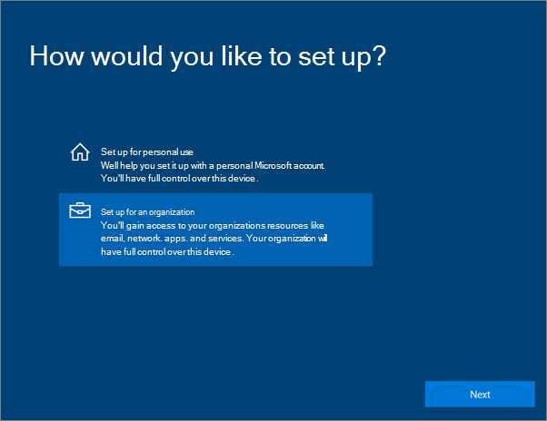
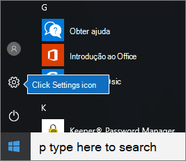
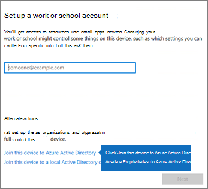
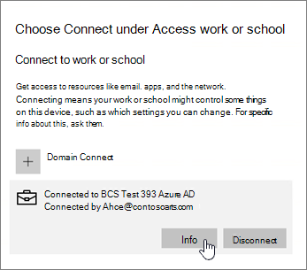

# Configurar dispositivos Windows para utilizadores Microsoft 365 Empresas Premium utilizadores

## Before you begin

Antes de poder configurar dispositivos Windows para utilizadores Microsoft 365 Empresas Premium, certifique-se de que todos os dispositivos Windows estão a ser Windows 10 Pro versão 1703 (Atualização para Criadores). Windows 10 Pro é um pré-requisito para implementar o Windows 10 Business, que é um conjunto de funcionalidades de gestão de dispositivos e serviços na nuvem que complementam o Windows 10 Pro e permitem a gestão centralizada e controlos de segurança do Microsoft 365 Empresas Premium.
  
Se tiver dispositivos Windows a executar o Windows 7 Pro, Windows 8 Pro ou Windows 8.1 Pro, a sua subscrição do Microsoft 365 Empresas Premium dá-lhe direito a Windows 10 atualização.
  
Para obter mais informações sobre como atualizar dispositivos Windows para a Atualização para Criativos do Windows 10 Pro, siga os passos neste tópico: [Atualizar dispositivos Windows para a Atualização para Criativos do Windows Pro](upgrade-to-windows-pro-creators-update.md).
  
Consulte Verificar se o dispositivo está ligado ao [Azure AD](#verify-the-device-is-connected-to-azure-ad) para verificar se tem a atualização ou para se certificar de que a atualização funcionou.

## Ver: Ligação PC para o Microsoft 365 Empresas

> [!VIDEO https://www.microsoft.com/videoplayer/embed/RE3yXh3] 

Caso tenha considerado este vídeo útil, veja a [série de formação completa para pequenas empresas e as novidades do Microsoft 365](../business-video/index.yml).
  
## Associar dispositivos Windows 10 ao Azure AD da sua organização

Quando todos os Windows dispositivos da sua organização foram atualizados para a Atualização para Criadores de Windows 10 Pro ou se já estiverem a executar a Atualização para Criadores do Windows 10 Pro, pode associar estes dispositivos à versão Azure Active Directory. Assim que os dispositivos estiverem associados, serão automaticamente atualizados para o Windows 10 Business, que faz parte da sua subscrição Microsoft 365 Empresas Premium dispositivos.
  
### Para um dispositivo Windows 10 Pro novo ou recentemente atualizado

Para um novo dispositivo a executar a Atualização para Criativos do Windows 10 Pro ou para um dispositivo que foi atualizado para a Atualização para Criativos do Windows 10 Pro, mas cuja configuração do dispositivo Windows 10 não tenha sido efetuada, siga estes passos.
  
1. Efetue a configuração do dispositivo Windows 10 até aceder à página **Como pretende configurar?**. 
    
    
  
2. Aqui, **selecionar Configurar para uma organização e,** em seguida, introduza o seu nome de utilizador e palavra-passe Microsoft 365 Empresas Premium. 
    
3. Conclua a configuração do dispositivo Windows 10.
    
   Quando terminar, o utilizador estará ligado ao Azure AD da sua organização. Consulte [Verificar se o dispositivo está ligado ao Azure AD](#verify-the-device-is-connected-to-azure-ad) para garantir que o dispositivo está ligado. 
  
### Para um dispositivo que já esteja configurado e a executar o Windows 10 Pro

 **Ligar utilizadores ao Azure AD:**
  
1. No PC Windows do seu utilizador com o Windows 10 Pro, versão 1703 (Atualização para Criativos) (consulte os [pré-requisitos](pre-requisites-for-data-protection.md)), clique no logótipo do Windows e, em seguida, no ícone Definições.
  
   
  
2. Nas **Definições**, aceda a **Contas**.
  
   
  
3. Na página **As suas informações**, clique em **Aceder a profiss./escolar** \> **Ligar**.
  
   
  
4. Na caixa de diálogo **Configurar uma conta escolar ou profissional**, em **Ações alternativas**, selecione **Adicionar este dispositivo ao Azure Active Directory**.
  
   
  
5. Na página **Vamos iniciar a sua sessão**, introduza a sua conta escolar ou profissional \> **Seguinte**.
  
   Na página **Introduzir palavra-passe**, introduza a sua palavra-passe \> **Iniciar sessão**.
  
   
  
6. Na página **Certifique-se de que esta é a sua organização,** verifique se as informações estão corretas e selecionar **Aderir.**
  
   Na **seta Está pronto!** , seleção **de Feito**.
  
   
  
Se tiver carregado ficheiros para o OneDrive para Empresas, sincronize-os novamente. Se tiver utilizado uma ferramenta de terceiros para migrar o perfil e os ficheiros, também os sincroniza com o novo perfil.
  
## Verificar se o dispositivo está ligado ao Azure AD

Para verificar o seu estado  de sincronização, na página Aceder  a trabalhos ou escolares no **Definições**, selecione a área Ligado a _ para expor os botões Informações e \<organization name\> **Desligar**.  **Selecionar Informações** para obter o seu estado de sincronização. 
  
Na página Estado **de sincronização,** selecionar **Sincronização** para obter as mais recentes políticas de gestão de dispositivos móveis no PC.
  
Para começar a utilizar a Microsoft 365 Empresas Premium conta, vá  para o Windows Iniciar, clique com o botão direito do rato na imagem da sua conta atual e, em seguida, **em Mudar de conta**. Inicie sessão com o endereço de e-mail e palavra-passe da sua organização.
  

  
## Verificar se o PC está atualizado para o Windows 10 Business

Verifique se os dispositivos associados ao Azure AD Windows 10 foram atualizados para os Windows 10 Business como parte da sua subscrição Microsoft 365 Empresas Premium subscrição.
  
1. Aceda a **Definições** \> **Sistema** \> **Acerca de**.
    
2. Confirme que a **Edição** apresenta **Windows 10 Business**.
    
    
  
## Passos seguintes

Para configurar os seus dispositivos móveis, consulte Configurar dispositivos móveis para utilizadores [Microsoft 365 Empresas Premium](set-up-mobile-devices.md), Para definir políticas de proteção de aplicações ou proteção de dispositivos, consulte Gerir o [Microsoft 365 para empresas.](manage.md)
  
## Conteúdos relacionados

[Microsoft 365 vídeos de formação para empresas](../business-video/index.yml) (página de ligação)
