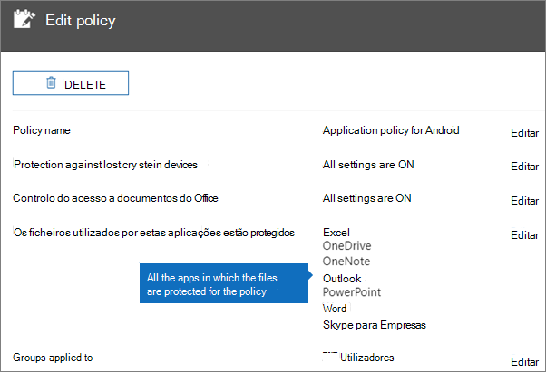
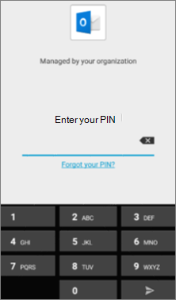
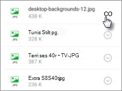
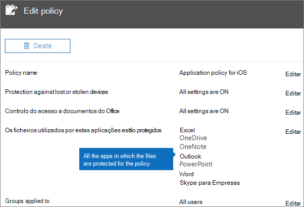
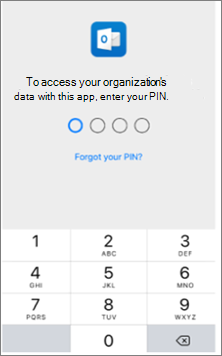

# Valide as definições de proteção de aplicativos em dispositivos Android ou iOS

Siga as instruções nas seguintes secções para validar as definições de proteção de aplicações em dispositivos Android ou iOS.
  
## Android
  
### Verifique se as definições de proteção de aplicações estão a funcionar em dispositivos de utilizador

Depois de [definir as configurações das aplicações para dispositivos Android](app-protection-settings-for-android-and-ios.md) para proteger as aplicações, pode seguir estes passos para verificar se as definições que escolheu estão a funcionar. 
  
Em primeiro lugar, certifique-se de que a apólice se aplica à aplicação na qual a vai validar.
  
1. No [centro de administração](https://portal.office.com)Microsoft 365 Business Premium, vá para a **política de edição**de **políticas.** \>
    
2. Escolha **a política de Aplicação para Android** para as definições que criou na configuração, ou outra política que criou, e verifique se é aplicada para o Outlook, por exemplo. 
    
    
  
### Verificar a opção para exigir um PIN ou uma impressão digital para aceder às aplicações do Office

No painel **Editar política**, selecione **Editar** junto a **Controlo do acesso a documentos do Office**. Expanda a secção **Gerir a forma como os utilizadores acedem a ficheiros do Office em dispositivos móveis** e certifique-se de que a opção **Exigir um PIN ou impressão digital para aceder às aplicações do Office** está definida como **Ativada**.
  

  
1. No dispositivo Android do utilizador, abra o Outlook e inscreva-se com as credenciais Microsoft 365 Business Premium do utilizador.
    
2. Também será solicitado a introduzir um PIN ou a utilizar uma impressão digital.
    
    
  
### Verificar a opção para repor o PIN após um número de tentativas falhadas

No painel de **política edite,** escolha **Editar** ao lado do controlo de acesso de **documentos do Office,** expandir **Gerir a forma como os utilizadores acedem aos ficheiros do Office em dispositivos móveis,** e certifique-se de que **o Reset PIN após o número de tentativas falhadas** está definido para algum número. Este é 5 por defeito. 
  
1. No dispositivo Android do utilizador, abra o Outlook e inscreva-se com as credenciais Microsoft 365 Business Premium do utilizador.
    
2. Introduza um PIN incorreto tantas vezes quanto for especificado pela política. Verá uma solicitação que indica **pin tente limite atingido** para redefinir o PIN. 
    
    
  
3. Prima **Repor PIN**. Será solicitado a iniciar sessão com as credenciais Microsoft 365 Business Premium do utilizador e, em seguida, obrigado a definir um novo PIN.
    
### Verificar a opção para forçar os utilizadores a guardar todos os ficheiros de trabalho no OneDrive para Empresas

No painel **Editar política**, selecione **Editar** junto a **Proteção contra dispositivos perdidos ou roubados**. Expanda a secção **Proteger os ficheiros de trabalho se os dispositivos forem perdidos ou roubados** e certifique-se de que a opção **Forçar os utilizadores a guardar todos os ficheiros de trabalho no OneDrive para Empresas** está definida como **Ativada**.
  

  
1. No dispositivo Android do utilizador, abra o Outlook e inscreva-se com as credenciais Microsoft 365 Business Premium do utilizador e introduza um PIN se solicitado.
    
2. Abra um e-mail que contenha um anexo e toque no ícone de seta para baixo junto às informações do anexo.
    
    
  
    Não pode **ser que se atire na** parte inferior do ecrã. 
    
    
  
    > [!NOTE]
    > A opção Guardar no OneDrive para Empresas não se encontra disponível para Android neste momento, por isso, só verá a opção para guardar localmente bloqueada. 
  
### Verificar a opção para exigir que o utilizador inicie sessão novamente caso as aplicações do Office estejam inativas durante um período de tempo específico

No painel de **política edite,** escolha **Editar** ao lado do controlo de acesso de **documentos do Office,** expandir **Gerir a forma como os utilizadores acedem aos ficheiros do Office em dispositivos móveis,** e certifique-se de que os utilizadores voltam a fazer o início depois de as aplicações do Office terem sido **inativas,** está definida para alguns minutos. São 30 minutos por defeito. 
  
1. No dispositivo Android do utilizador, abra o Outlook e inscreva-se com as credenciais Microsoft 365 Business Premium do utilizador e introduza um PIN se solicitado.
    
2. Já deverá ver a caixa de entrada do Outlook. Não faça alterações ao dispositivo Android inativo durante, pelo menos, 30 minutos (ou outro período de tempo superior ao especificado na política). Provavelmente, o ecrã do dispositivo ficará mais escuro.
    
3. Access Outlook no dispositivo Android novamente.
    
4. Será solicitado a introduzir o seu PIN antes de poder aceder novamente ao Outlook.
    
### Verificar a opção para proteger ficheiros de trabalho com encriptação

No painel **Editar política**, selecione **Editar** junto a **Proteção contra dispositivos perdidos ou roubados**. Expanda a janela **Proteger os ficheiros de trabalho se os dispositivos forem perdidos ou roubados** e certifique-se de que a opção **Proteger ficheiros de trabalho com encriptação** está definida como **Ativada** e a opção **Forçar os utilizadores a guardar todos os ficheiros de trabalho no OneDrive para Empresas** está definida como **Desativada**.
  
1. No dispositivo Android do utilizador, abra o Outlook e inscreva-se com as credenciais Microsoft 365 Business Premium do utilizador e introduza um PIN se solicitado.
    
2. Abra um e-mail que contenha alguns anexos de ficheiros de imagem.
    
3. Toque no ícone de seta para baixo junto às informações do anexo para guardá-lo.
    
    
  
4. Poderá ser-lhe pedido para permitir que o Outlook aceda às fotografias, multimédia e ficheiros no seu dispositivo. Toque em **Permitir**.
    
5. Na parte inferior do ecrã, selecione **Guardar no Dispositivo** e, em seguida, abra a aplicação **Galeria**. 
    
6. Deverá ver uma fotografia encriptada (ou mais, caso tenha guardado múltiplos anexos de ficheiros de imagem) na lista. A fotografia poderá ser apresentada na Lista de imagens como um quadrado cinzento com um ponto de exclamação branco dentro de um círculo branco no centro do quadrado cinzento.
    
    
  
## iOS
  
### Verificar se as definições de proteção de aplicações estão a funcionar nos dispositivos dos utilizadores

Depois de [definir as configurações das aplicações para dispositivos iOS](app-protection-settings-for-android-and-ios.md) para proteger as aplicações, pode seguir estes passos para verificar se as definições que escolheu estão a funcionar. 
  
Em primeiro lugar, certifique-se de que a apólice se aplica à aplicação na qual a vai validar.
  
1. No [centro de administração](https://portal.office.com)Microsoft 365 Business Premium, vá para a **política de edição**de **políticas.** \>
    
2. Escolha a política de **Aplicação para iOS** para as definições que criou na configuração, ou outra política que criou, e verifique se é aplicada para o Outlook, por exemplo. 
    
    
  
### Verificar a opção para exigir um PIN para aceder às aplicações do Office

No painel **Editar política**, selecione **Editar** junto a **Controlo do acesso a documentos do Office**. Expanda a secção **Gerir a forma como os utilizadores acedem a ficheiros do Office em dispositivos móveis** e certifique-se de que a opção **Exigir um PIN ou impressão digital para aceder às aplicações do Office** está definida como **Ativada**.
  

  
1. No dispositivo iOS do utilizador, abra o Outlook e inscreva-se com as credenciais Microsoft 365 Business Premium do utilizador.
    
2. Também será solicitado a introduzir um PIN ou a utilizar uma impressão digital.
    
    
  
### Verificar a opção para repor o PIN após um número de tentativas falhadas

No painel de **política edite,** escolha **Editar** ao lado do controlo de acesso de **documentos do Office,** expandir **Gerir a forma como os utilizadores acedem aos ficheiros do Office em dispositivos móveis,** e certifique-se de que **o Reset PIN após o número de tentativas falhadas** está definido para algum número. Este é 5 por defeito. 
  
1. No dispositivo iOS do utilizador, abra o Outlook e inscreva-se com as credenciais Microsoft 365 Business Premium do utilizador.
    
2. Introduza um PIN incorreto tantas vezes quanto for especificado pela política. Verá uma solicitação que indica **pin tente limite atingido** para redefinir o PIN. 
    
    
  
3. Prima **OK**. Será solicitado a iniciar sessão com as credenciais Microsoft 365 Business Premium do utilizador e, em seguida, obrigado a definir um novo PIN.
    
### Verificar a opção para forçar os utilizadores a guardar todos os ficheiros de trabalho no OneDrive para Empresas

No painel **Editar política**, selecione **Editar** junto a **Proteção contra dispositivos perdidos ou roubados**. Expanda a secção **Proteger os ficheiros de trabalho se os dispositivos forem perdidos ou roubados** e certifique-se de que a opção **Forçar os utilizadores a guardar todos os ficheiros de trabalho no OneDrive para Empresas** está definida como **Ativada**.
  

  
1. No dispositivo iOS do utilizador, abra o Outlook e inscreva-se com as credenciais Microsoft 365 Business Premium do utilizador e introduza um PIN se solicitado.
    
2. Abra um e-mail que contenha um anexo, abra o anexo e selecione **Guardar** na parte inferior do ecrã. 
    
    
  
3. Deverá ver apenas uma opção para o OneDrive para Empresas. Caso contrário, toque em **Adicionar Conta** e selecione **OneDrive para Negócios** a partir do ecrã **da Conta de Armazenamento Adicionar.** Forneça ao Microsoft 365 Business Premium do utilizador final para iniciar sessão quando solicitado. 
    
    Toque em **Guardar** e selecione **OneDrive para Empresas**.
    
### Verificar a opção para exigir que o utilizador inicie sessão novamente caso as aplicações do Office estejam inativas durante um período de tempo específico

No painel de **política edite,** escolha **Editar** ao lado do controlo de acesso de **documentos do Office,** expandir **Gerir a forma como os utilizadores acedem aos ficheiros do Office em dispositivos móveis,** e certifique-se de que os utilizadores voltam a fazer o início depois de as aplicações do Office terem sido **inativas,** está definida para alguns minutos. São 30 minutos por defeito. 
  
1. No dispositivo iOS do utilizador, abra o Outlook e inscreva-se com as credenciais Microsoft 365 Business Premium do utilizador e introduza um PIN se solicitado.
    
2. Já deverá ver a caixa de entrada do Outlook. Não faça alterações ao dispositivo iOS durante, pelo menos, 30 minutos (ou outro período de tempo superior ao especificado na política). Provavelmente, o ecrã do dispositivo ficará mais escuro.
    
3. Acesso Outlook no dispositivo iOS novamente.
    
4. Será solicitado a introduzir o seu PIN antes de poder aceder novamente ao Outlook.
    
### Verificar a opção para proteger ficheiros de trabalho com encriptação

No painel **Editar política**, selecione **Editar** junto a **Proteção contra dispositivos perdidos ou roubados**. Expanda a janela **Proteger os ficheiros de trabalho se os dispositivos forem perdidos ou roubados** e certifique-se de que a opção **Proteger ficheiros de trabalho com encriptação** está definida como **Ativada** e a opção **Forçar os utilizadores a guardar todos os ficheiros de trabalho no OneDrive para Empresas** está definida como **Desativada**.
  
1. No dispositivo iOS do utilizador, abra o Outlook e inscreva-se com as credenciais Microsoft 365 Business Premium do utilizador e introduza um PIN se solicitado.
    
2. Abra um e-mail que contenha alguns anexos de ficheiros de imagem.
    
3. Toque no anexo e, em seguida, toque na opção **Guardar** por baixo do mesmo. 
    
4. Abra a aplicação **Fotografias** no ecrã principal. Deverá ver uma fotografia (ou mais, se tiver guardado múltiplos anexos de ficheiros de imagem) guardada, embora esteja encriptada. 
    
---

