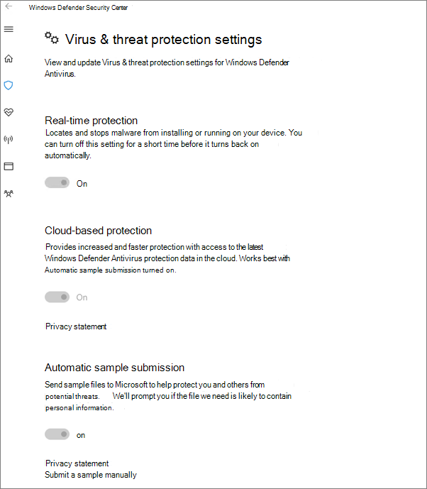

# Validar as definições de proteção de dispositivos Windows 10 PCs

## Verificar se as Windows 10 dispositivos estão definidas

Após [configurar as políticas de dispositivos,](protection-settings-for-windows-10-pcs.md)poderá demorar até algumas horas para que a política entre em vigor nos dispositivos dos utilizadores. Pode confirmar que as políticas foram em vigor ao ver vários ecrãs Windows Definições ecrãs nos dispositivos dos utilizadores. Uma vez que os utilizadores não poderão modificar as definições Windows Atualização Antivírus do Windows Defender dos respetivos dispositivos de Windows 10, muitas opções estarão a cinzento.
  
1. Vá para a **Definições** Opções de \> **&amp; Windows** Atualizar \>  \> **Reinício** e confirme que todas as definições estão a cinzento. 
    
    
  
2. Vá para o **Definições** \> **&amp; Atualizar segurança** Windows Atualizar opções Avançadas e confirme que todas as \>  \>  definições estão a cinzento. 
    
    
  
3. Vá para o **Definições** \> **Atualizar &amp; segurança Windows** Opções \> **de** \> **Atualização Avançadas** \> **Selecionar a forma como as atualizações são entregues**.
    
    Confirme que consegue ver a mensagem (a vermelho) de que algumas definições estão ocultas ou geridas pela sua organização e de que todas as opções estão desa cinzento.
    
    
  
4. Para abrir o Centro de Windows Defender  de Segurança do Definições atualizar a segurança Windows Defender clique em Abrir Windows Defender definições de proteção contra vírus contra \> **&amp;** \>  \>  \> **&amp;** \> **&amp; ameaças** por thread do Centro de Segurança do Windows Defender . 
    
5. Verifique se todas as opções estão a cinzento. 
    
    
  
## Tópicos Relacionados

[Microsoft 365 para recursos e documentação empresarial](./index.yml)
  
[Começar a trabalhar com o Microsoft 365 para empresas](microsoft-365-business-overview.md)
  
[Gerir Microsoft 365 para empresas](manage.md)
  
[Definir as configurações de dispositivos para PCs Windows 10](protection-settings-for-windows-10-pcs.md)
